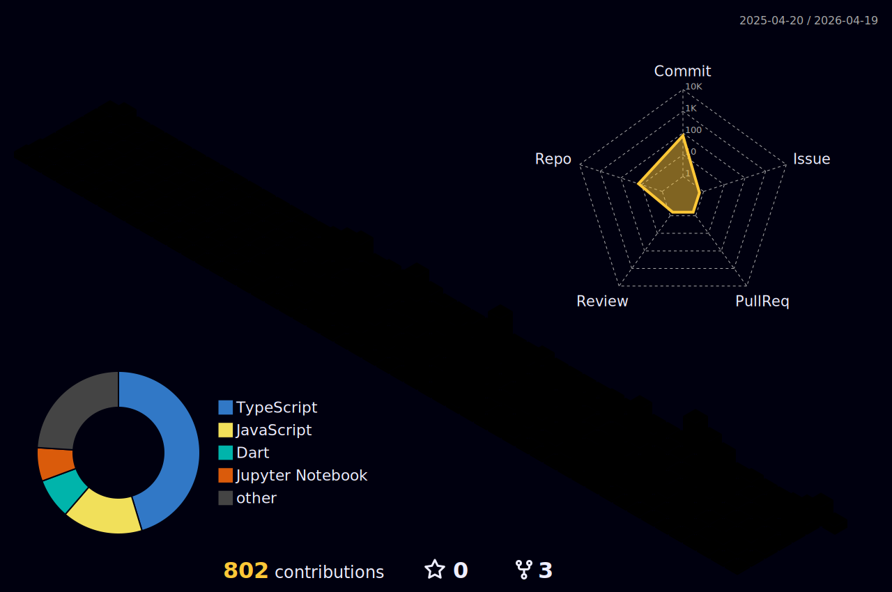

<p align="center">
  
</p>

<p align="center">
  <a href="https://github.com/HaikalFaruq?tab=followers"></a>
  <a href="https://github.com/HaikalFaruq"></a>
  <a href="https://www.linkedin.com/in/muhammad-haikal-faruq-923b62336/"></a>
  <a href="mailto:haikalfaruq2004@gmail.com"></a>
</p>

---

### 👨‍💻 About me
Hey! I'm **Haikal Faruq** — a software engineer who loves mixing solid engineering with clean, user‑friendly design. I build full‑stack apps (frontend + backend), tinker with data/AI, and enjoy teaching what I learn.

- 🧭 Interests: Frontend/Backend dev, DX, automation, a bit of data/AI
- 🌱 Currently exploring: modern React/Next.js, Node/Express, Python data tooling

---

### 🧰 Tech & Tools I use
<p>
  <a href="https://skillicons.dev">
    
  </a>
</p>

---

### 📊 GitHub Stats

<p align="center">
  <a href="https://git.io/streak-stats">
    
  </a>
</p>

<p align="center">
  
</p>

<table align="center">
<tr>
  <td></td>
  <td></td>
</tr>
<tr>
  <td></td>
  <td></td>
</tr>
</table>


---

### 📈 Activity Graph
<p align="center">
  
</p>

---

### 🧱 3D Contribution Graph
<p align="center">
  
</p>

---

### ⏱️ WakaTime
<!-- Requires WakaTime account + GitHub Action (athul/waka-readme). The block below will auto‑fill each day. -->
<!--START_SECTION:waka-->

```txt
Dart   18 mins         █████████████████████████   99.90 %
YAML   0 secs          ░░░░░░░░░░░░░░░░░░░░░░░░░   00.10 %
```

<!--END_SECTION:waka-->
